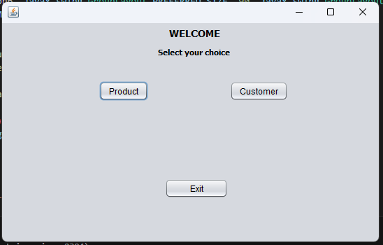
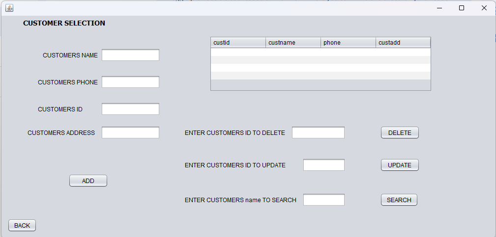
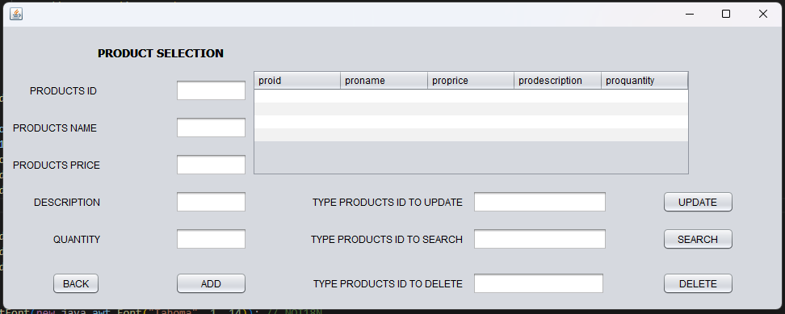

#Wholesale Management System
##Project Description
This project aims to create an automated tool for managing the inventory of a wholesaler. Its primary goal is to streamline and automate inventory control processes within a wholesale business. The system is designed to provide a comprehensive solution for managing products, customers, and overall inventory, targeting business owners and employees who need efficient data management and operational capabilities.

###Features
The system supports full CRUD (Create, Read, Update, Delete) operations, allowing users to:
•	Create: Add new records for products, customers, and other relevant entities.
•	Read: Retrieve and view existing data.
•	Update: Modify details of existing records.
•	Delete: Remove records from the system.

###Technologies Used
The "Wholesale Management System" is built using the following technologies:
•	Frontend: Java GUI
•	Backend & Database: SQL Relational Database Management System (RDBMS)
•	Java Development Kit: gjdk-8u151-windows-x64
•	Database Management Tool: SSMS-Setup-ENU (SQL Server Management Studio)
•	JDBC Driver: mysql-connector-java-5.1.42-bin (for MySQL database connectivity)

###Database Schema
The database schema includes tables to manage various aspects of the wholesale business. Based on the provided information, key tables are:
•	Product Table:
o	proid (Product ID)
o	proname (Product Name)
o	proprice (Product Price)
o	prodiscription (Product Description)
o	proquantity (Product Quantity)

•	Customer Table:
o	custid (Customer ID)
o	custname (Customer Name)
o	custphone (Customer Phone Number)
o	custadd (Customer Address)

###Setup and Installation
###Prerequisites
•	Java Development Kit (JDK) - gjdk-8u151-windows-x64 or compatible version.
•	A SQL RDBMS (e.g., MySQL or SQL Server) installed and configured.
•	SQL Server Management Studio (SSMS) - SSMS-Setup-ENU (if using SQL Server).
•	MySQL Connector/J - mysql-connector-java-5.1.42-bin (if using MySQL).

###Usage
###To use the Wholesale Management System:
1.	Start the Application: When the project runs, the login page will appear first.

2.	Navigation: As a wholesaler, you can then navigate to the Customers or Products sections from the main interface.
3.	Manage Customers: 
o	Click on the "Customers" option.
o	Here, you will be able to perform full CRUD operations on customer records (add new customers, view existing ones, update their details, or delete them).

4.	Manage Products: 
o	You can click back from the customer section to return to the main navigation.
o	Select the "Products" option.
o	In the product section, you can perform CRUD operations on product inventory, including adding new products, deleting old ones, updating stock quantities and prices, and searching for specific products.   

